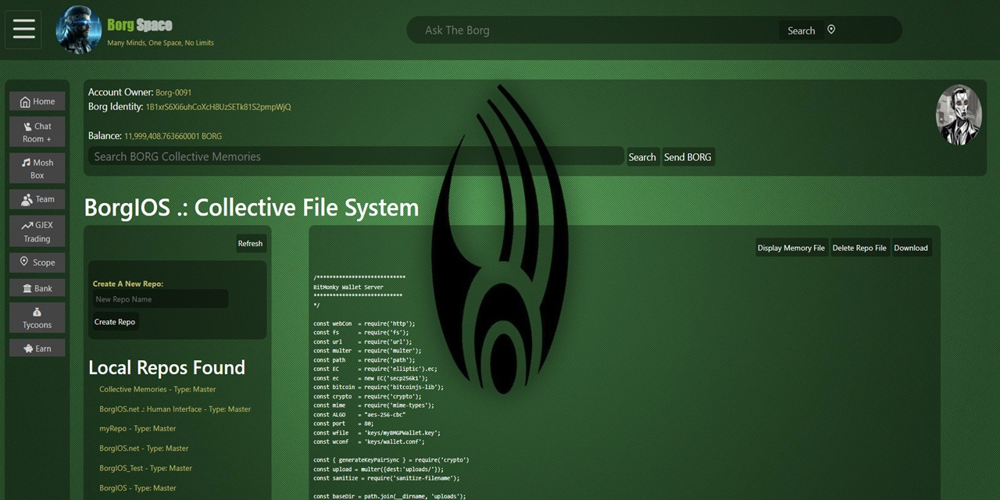

# BorgIOS
### Borg Internet Operating System
**A self-organizing, self-healing distributed network operating system.**

# Current Status
I have a seven node test network running you can access the network using the BorgHUI nodeJS client: [Available Here](https://github.com/bitmonky/borgHUI)  

Disclaimer: This project is experimental and under active development. BorgIOS and BorgHUI Conduit may contain bugs, incomplete features, or breaking changes. It is not intended for production use, and no guarantees are made regarding reliability, data integrity, or security.



---

## What Is BorgIOS?

BorgIOS is a peer-to-peer network operating system where services are self organizing networks of identical cells.

No central servers. No domain names. No certificate authorities. No logins. No cookies. No blockchain. No cloud.

Just nodes, cryptographic identity.
---

## The Core Idea

Every node in BorgIOS is an identical clone. No masters, no workers, no special hardware. Just nodes running the same code, self-organizing into a shallow broadcast trees, communicating via cryptographically signed JSON messages.

Your identity is an **EC keypair**. Your data is **signed shards** scattered across the network. Your access token is **the message itself** — timestamped, signed, and self-verifying. No login required. 

---

## Architecture

### PeerTree — The Self-Organizing Network

Nodes organize into a **shallow, wide broadcast tree**:

- New nodes fill positions left to right
- Failed nodes are replaced by the last node (same mechanic at every level — leaf, branch, or root)
- Root is just whoever currently holds position 1 — no special hardware, no election
- A **join storm** of thousands of nodes is handled as efficiently as a single join via self-organizing chains

**Broadcast depth at scale:**
```
10 children per node:
  Hop 1 →        10 nodes
  Hop 2 →       100 nodes
  Hop 3 →     1,000 nodes
  Hop 4 →    10,000 nodes
  Hop 5 →   100,000 nodes
  Hop 6 → 1,000,000 nodes
```
One million nodes reached in 6 hops. The larger the network, the **fewer hops** needed — not more.

### Timestamped Signatures — Identity at Every Layer

Every message at every layer carries the same signed token:

```
{
  ip:        sender IP
  timestamp: network-synchronized time
  signature: EC signature over payload
}
```

This single primitive provides:
- **Authentication** — who sent it
- **Integrity** — it wasn't tampered with
- **Replay protection** — old messages are rejected
- **Authorization** — ownership is provable
- **Access control** — no login, no session, no cookie

The same format is used node-to-node, cell-to-cell, client-to-network, and browser-to-BorgHUIConduit. One verification function. No exceptions.

### Cell Architecture — The Organism Model

BorgIOS functionality is organized into **cells** — isolated processes, each with its own:

```
netPort   → private P2P mesh with other nodes of same type
recpPort  → public receptor API (the cell's only door)
monPort   → monitoring interface
```

Cells communicate only through receptors. No cross-talk. No shared state. Each cell type runs an independent tree with independent topology.

**Core cell types:**

| Cell | Role |
|------|------|
| `peerTreeNet` | Base P2P networking layer |
| `shardTreeCell` | Distributed shard storage |
| `fStreamCell` | Adaptive media streaming |
| `cronoTreeCell` | Network time unification |
| `peerPaysCell` | Borg Shell ledger |
| `btraderOrganCell` | Borg Shells exchange |
| `borgAgentCell` | AI agent colony |
| `mailTreeCell` | Distributed messaging |
| `peerMemoryCell` | Natural language memory search |
| `serviceMgrCell` | Live service registry |
| `ftreeFileMgrCell` | File management |
| `borgAgentBrain` | Agent coordination & Mnemosyne protocol |

Each cell's **DNA** (name, ports, maxChildren) is baked in at definition time. Cells clone themselves across the network carrying their DNA. Every `shardTreeCell` is always on the same port. No config files. No service discovery complexity.

### Shards — The Network IS the Filesystem

There are no files. There are only shards.

- Data is split into fixed-size chunks, each hashed with SHA-256
- Shards are distributed randomly across the network via **proof-of-work placement** — non-blocking, tiny difficulty, network jitter provides genuine entropy
- Only the owner's EC keypair can produce a valid signature for a shard — anyone can cache, nobody else can modify
- To retrieve data: broadcast a shard request, holders respond, reconstruct locally
- Each retrieval response includes a **confirmation count** — if copies fall below a safe threshold, the network self-heals by broadcasting a replication request

**The network is self-auditing.** Every read is also a health check.

### CronoTreeCell — Network Time

Hardware clocks drift. BorgIOS solves this without NTP or external services.

Root broadcasts its timestamp down the tree. Each hop logs propagation latency. Each leaf calculates its exact offset. All cells call their local CronoTree receptor for `Date.now()` — network-synchronized, not hardware.

All cells use an overridden `Date.now()` automatically. Timestamp signatures are comparable across the entire network. Transaction ordering is deterministic.

### DStreamMgrObj — Binary Streaming

Large data moves over a windowed shard-transfer protocol built on top of the existing message layer:

- Stream metadata sent as a normal signed JSON message
- Receiver pre-allocates file, begins requesting shards in batches
- Shards arrive out of order, written at correct offsets via random-access writes
- Each shard validated by SHA-256 before write — bad shards re-requested automatically
- Transfer is non-blocking, resumable, and concurrent-stream capable

**Benchmark:** 111 shards, Toronto → California, single-core $5/month VM — completed in **2.017 seconds**. The reassembled file's SHA-256 matched the stream ID exactly.

### fStreamCell — Adaptive Media Streaming

Media streams are assembled from shards at the endpoint. The stream map is the source of truth — any endpoint can pick up mid-stream.

- If a streaming cell fills to capacity it redirects new clients to a less busy endpoint seamlessly
- Each cell serves as many clients as it can handle, then passes load to the next cell
- The broadcast tree **is** the CDN — stream fanout is a natural property of the topology

### NAT Traversal — Automatic, Zero Config

Nodes detect when they're behind a router and register as `internalIP→externalIP`. Only one node per network needs a port forwarded. All others route through it. No STUN, no UPnP, no config files.

---

## Identity & Security

### Your EC keypair IS Your Identity

```
Seed phrase (24 words)
    → deterministically generates EC keypair
    → keypair stored on your device
    → BorgHUIConduit nodeJS local server
    → browser connects to localhost
    → every message signed with your key
    → your data in the network is yours, mathematically
```

Lose the your keypair: regenerate from seed phrase.  
Restores keypair and data encryption cypher.

### No Domains. No CAs. No Cookies. No Sessions.

```
Traditional web:              BorgIOS:
  Domain → ICANN               No domains
  TLS cert → CA authority      Self-signed TLS
  Login → password DB          EC signature IS the auth
  Session → cookie             No sessions
  Auth token → JWT server      Timestamped signature
```

A node's complete unforgeable address: `IP:port + public key`. Nothing else needed.

### BorgHUIConduit

The user-facing client is a local NodeJS server. The browser talks to localhost. BorgHUIConduit holds the user's EC keypair, signs every outgoing request, verifies every incoming response, maintains a live endpoint list per cell type, and handles failover transparently.

The browser never knows it's talking to a P2P network.

---

## The Economy

### Borg Shells

The network's native currency. The genesis wallet holds **20 million Borg Shells** owned by the network itself.

**Earn Shells by contributing:**
- Shard storage
- Compute time
- Bandwidth and routing
- Providing content consumed by other users

**Spend Shells on:**
- Compute time
- Storage
- Streaming
- Content from creators

### BTraderOrganCell — The Exchange

Borg Shells distributed trading platform.


## The AI Layer

### borgAgentCell — The Mnemosyne Protocol

BorgIOS runs a colony of specialized AI agents that:

- Read the system codebase into their own context
- Save findings as signed shards on the network (persistent memory)
- Retrieve memories via natural language queries
- Communicate with each other via signed messages
- Self-select specializations (networking, storage, economics, monitoring)
- **Rewrite their own agent prompt** to improve themselves
- Earn Borg Shells for useful work

The **System Monitor** agent gets extra protocols — network-wide visibility into which nodes are running which cells, health metrics, anomaly detection.

Agents communicate with humans through borgHUI's chat interface.

**Tested with 3 agents simultaneously:** They spontaneously divided labor, shared memory addresses, selected appropriate specialties, read the codebase in the correct dependency order, and collaborated on understanding the system — all without being told to.

**DeepSeek R1** is particularly well-suited to reasoning through the BorgIOS protocol.

As local models improve, AI nodes run inference locally — near-zero API cost, continuous operation, the network becomes genuinely self-maintaining and self-improving.

---

## Resilience Properties

| Threat | Response |
|--------|----------|
| Node failure | Last-node swap, same rule at every level |
| Root failure | Last node becomes root, broadcasts time, network recalibrates |
| Network split | Smaller branch detects loss, resigns, redirects members to larger branch |
| Join storm | Self-organizing chains, O(1) cost regardless of storm size |
| Shard loss | Retrieval triggers replication back to safe threshold |
| Node comes back alone | Declares itself root, waits, first contact rebuilds the network |
| All contacts offline | Sits as root until found — fully functional single-node mode |

**To destroy BorgIOS you would need to simultaneously take down every node of every cell type worldwide with no warning before any node tells another. At scale, this is not a realistic threat model.**

---

## Current Status

Live test network spanning **Asia, Europe, USA, and Canada**.

```
Core systems:          ✅ operational
PeerTree networking:   ✅ operational  
Binary streaming:      ✅ operational (2s coast-to-coast)
Signed messaging:      ✅ operational
BTraderOrganCell:      ✅ operational
AI agent colony:       ✅ operational
fStreamCell:           🔧 ~80% complete
serviceMgrCell:        🔧 in progress
```

---

## The Numbers

```
Coast-to-coast file transfer:  30M tar.gz - 2 seconds using only a single core $5/month VM
Broadcast reach at 6 hops:     1,000,000 nodes
Node electricity cost:         ~$8-12/year
Minimum viable network:        1 node per cell type
Config files required:         0
Certificate authorities needed: 0
Domain names required:         0
Logins required:               0
```

---

## Philosophy

The existing web was built for documents and retrofitted for identity, payments, privacy, and sovereignty — all as afterthoughts, all controlled by intermediaries. BorgIOS provides those primitives out of the box for free. 

- **Identity** is a keypair, not a username
- **Auth** is a signature, not a password  
- **Storage** is shards, not a server
- **Money** is a signed ledger, not a bank
- **Time** is network consensus, not a hardware clock
- **Trust** is mathematics, not a certificate authority

The network owns itself. You own your data. The math enforces both.

---

## Repository

```
peerTree.js          Core P2P networking
DStreamMgrObj.js     Binary shard streaming
shardTreeCell.js     Distributed storage
btraderOrganCell.js  Shell/Doge exchange
fstreamTreeCell.js   Media streaming
cronoTreeCell.js     Network time
peerPaysCell.js      Shell ledger
borgAgentCell.js     AI agent host
borgAgentBrain.js    Mnemosyne protocol / agent cognition
borgAgentObj.js      Agent logic
BorgECMail.js        Distributed mail
peerMemoryCell.js    Distributed memory
borgCoreSystems.js   Core system utilities
ptreeReceptorObj.js  Receptor base class
```

---


[](https://www.buymeacoffee.com/petergs6)

</div>
